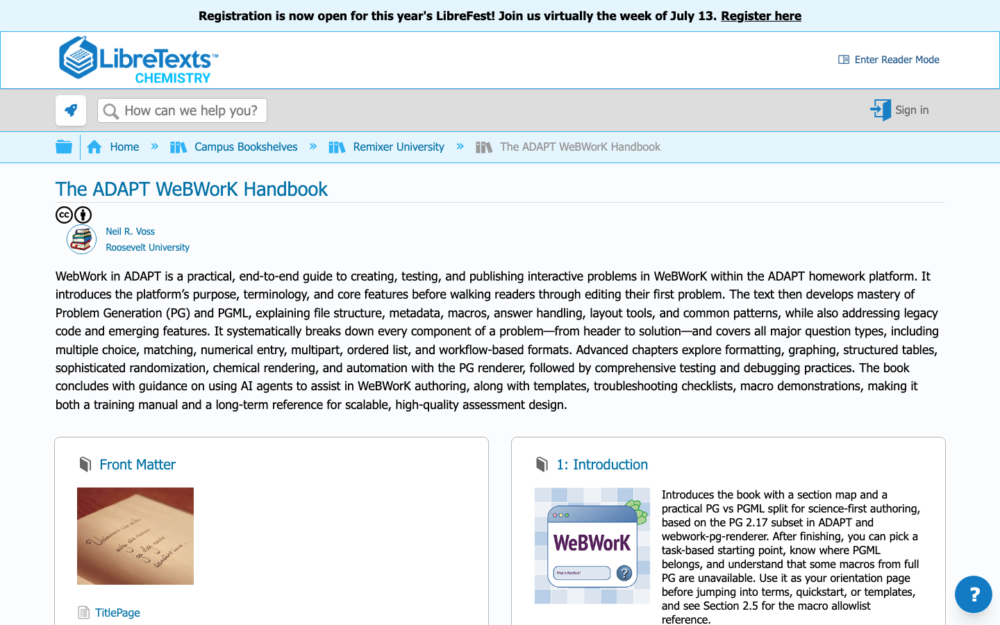

# Writing automated questions using WeBWorK in ADAPT

A practical, PGML-first textbook for science educators creating randomized, automatically graded WeBWorK questions in ADAPT, with copy-ready biology examples and local validation tools.

**[Read The ADAPT WeBWorK Handbook on Chemistry LibreTexts](https://chem.libretexts.org/Courses/Remixer_University/The_ADAPT_WeBWorK_Handbook)**

The published book is the primary reading experience. This repository contains its LibreTexts-ready source chapters, examples, and validation tools.

<!-- screenshots:begin (managed by screenshot-docs) -->

<!-- screenshots:end -->

## Turn one working problem into many

Start with a complete problem that already grades correctly, change the science story before changing the mathematics, and preview several randomized variants before publishing. This book makes that safe copy-edit-test cycle the center of WeBWorK authoring.

- Write student-facing prompts in PGML while keeping regular PG focused on setup and answer checking.
- Adapt life-science examples built around counts, concentrations, protocols, structures, and data.
- Choose among numeric entry, multiple choice, matching, ordering, and multi-part interactions.
- Test problems through ADAPT or `webwork-pg-renderer`, then use line-level diagnostics when rendering fails.
- Work within the documented ADAPT macro subset instead of discovering version incompatibilities after authoring.

## See the PGML-first pattern

This excerpt from the complete quick-start problem randomizes two values, binds their sum to an answer object, and keeps the learner-facing language readable:

```perl
$a = random(2, 8, 1);
$b = random(3, 9, 1);
$ans = Real($a + $b);

BEGIN_PGML
In a lab notebook, two counts were recorded: [$a] and [$b].

What is the total count?

[`Total = `] [________]{$ans}
END_PGML
```

Each preview produces a new pair of counts while the answer blank remains connected to the correct sum. The [complete quick-start skeleton](Textbook/01_Introduction/1.6-Quickstart_copy_edit_first_problem.html) includes the required document structure, macros, context, and ending.

## Compatibility at a glance

- The guide targets the flattened ADAPT and `webwork-pg-renderer` macro set based on PG 2.17; some macros from full or newer PG installations are unavailable.
- Regular PG is used as minimal scaffolding. PGML is the preferred authoring layer for prompts, layout, and answer blanks.
- Chapter HTML is designed for LibreTexts import and cannot depend on JavaScript.

## Start here

- New to WeBWorK or ADAPT? [Read the published handbook](https://chem.libretexts.org/Courses/Remixer_University/The_ADAPT_WeBWorK_Handbook) for the terminology, platform context, and PG-versus-PGML model.
- Ready to make a question? Use the published [Quickstart: Edit Your First Problem](https://chem.libretexts.org/Courses/Remixer_University/The_ADAPT_WeBWorK_Handbook/01%3A_Introduction/1.06%3A_Quickstart_-_Edit_Your_First_Problem) for the first copy-edit-preview cycle.
- Need a reusable starting file? Choose a complete pattern from [Textbook/90_Appendices/90.1-Minimal_templates.html](Textbook/90_Appendices/90.1-Minimal_templates.html).

## Quick start

You need access to an ADAPT question editor or a compatible local `webwork-pg-renderer` instance to preview and grade the result.

1. Open [Quickstart: Edit Your First Problem](https://chem.libretexts.org/Courses/Remixer_University/The_ADAPT_WeBWorK_Handbook/01%3A_Introduction/1.06%3A_Quickstart_-_Edit_Your_First_Problem) in the published handbook.
2. Copy its complete minimal skeleton into your question editor.
3. Change only the lab-notebook story text while leaving variable names, mathematics, and the answer object intact.
4. Preview several variants, confirm that the displayed counts change, and submit their sums.

Success means every variant reads naturally and accepts the sum shown in that variant. Once that works, change numbers or formulas one small step at a time.

## Book contents

- [Textbook/01_Introduction/1.0-Index.html](Textbook/01_Introduction/1.0-Index.html): WeBWorK, ADAPT, core terminology, and a first copy-and-edit workflow.
- [Textbook/02_Problem_Generation_PG/2.0-Index.html](Textbook/02_Problem_Generation_PG/2.0-Index.html): Minimal PG scaffolding, metadata, macros, and legacy patterns.
- [Textbook/03_PGML_PG_Markup_Language/3.0-Index.html](Textbook/03_PGML_PG_Markup_Language/3.0-Index.html): PGML syntax for student-facing prompts, notation, lists, tables, and substitutions.
- [Textbook/04_Breaking_Down_the_Components/4.0-Index.html](Textbook/04_Breaking_Down_the_Components/4.0-Index.html): A complete problem divided into its header, preamble, setup, statement, and solution.
- [Textbook/05_Different_Question_Types/5.0-Index.html](Textbook/05_Different_Question_Types/5.0-Index.html): Interaction patterns, ADAPT workflow, and question-quality checks.
- [Textbook/06_Advanced_PGML_Techniques/6.0-Index.html](Textbook/06_Advanced_PGML_Techniques/6.0-Index.html): Richer formatting, randomization, graphs, and scientific structures.
- [Textbook/07_Testing_and_Debugging/7.0-Index.html](Textbook/07_Testing_and_Debugging/7.0-Index.html): Linting, renderer-based testing, debugging, and final QA.
- [Textbook/08_Using_AI_Agents_to_Write_WeBWorK/8.0-Index.html](Textbook/08_Using_AI_Agents_to_Write_WeBWorK/8.0-Index.html): AI-assisted authoring, knowledge documents, renderer feedback, and prompt design.
- [Textbook/90_Appendices/90.0-Index.html](Textbook/90_Appendices/90.0-Index.html): Templates, glossary entries, and troubleshooting references.

## Contribute to the textbook

The source chapters are LibreTexts-ready HTML under `Textbook/`. Keep edits aligned with [Textbook/TEXTBOOK_PAGE_SUMMARIES.md](Textbook/TEXTBOOK_PAGE_SUMMARIES.md), then run the local content checks from the repository root:

```bash
bash tests/run_html_lint.sh
source source_me.sh && python tools/check_external_links.py
```

A clean run reports that all textbook HTML files pass and that no confirmed 404 or 410 external links remain.

## Documentation

- [Textbook/TEXTBOOK_PAGE_SUMMARIES.md](Textbook/TEXTBOOK_PAGE_SUMMARIES.md): Scope, learner outcome, and intended use of every textbook page.
- [docs/LIBRETEXTS_HTML_GUIDE.md](docs/LIBRETEXTS_HTML_GUIDE.md): Supported HTML patterns and LibreTexts import constraints.
- [docs/ACCESSIBILITY_REVIEW.md](docs/ACCESSIBILITY_REVIEW.md): Accessibility requirements and verification guidance.
- [docs/LINKING_AND_SECTION_NUMBERING.md](docs/LINKING_AND_SECTION_NUMBERING.md): Internal linking and page-numbering conventions.
- [docs/CODE_ARCHITECTURE.md](docs/CODE_ARCHITECTURE.md): Authoring workflow, supporting tools, and validation flow.
- [docs/FILE_STRUCTURE.md](docs/FILE_STRUCTURE.md): Repository layout and where new work belongs.

## Getting help

Report errors, broken examples, or unclear explanations through [GitHub Issues](https://github.com/vosslab/webwork-pgml-libretexts-adapt-texbook/issues). Maintainer and project background are documented in [docs/AUTHORS.md](docs/AUTHORS.md).

## Related resources

- [LibreTexts Insight: WeBWorK techniques](https://commons.libretexts.org/insight/webwork-techniques)
- [OpenWeBWorK PG documentation and sample problems](https://openwebwork.github.io/pg-docs/)
- [vosslab/webwork-pg-renderer](https://github.com/vosslab/webwork-pg-renderer)
- [Biology Problems](https://biologyproblems.org/)

## License

The textbook and documentation use [Creative Commons Attribution 4.0 International](LICENSE), the repository's primary license. Code and utilities use the [GNU Lesser General Public License, version 3](LICENSE.LGPL-3.0.md).
